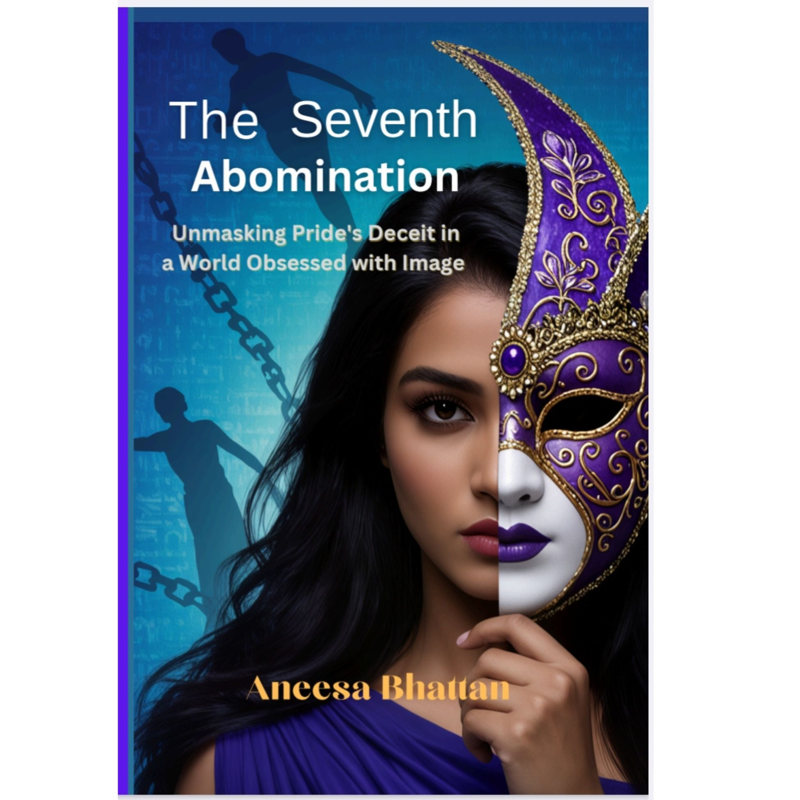

# seventh-abomination-guide

# 🌟 The Seventh Abomination 🌟
Discover "The Seventh Abomination" – a transformative guide to breaking free from comparison, insecurity, and self-doubt.
# 🌟 The Seventh Abomination: Unmasking Pride's Deceit in a World Obsessed with Image 🌟

**Author:** Aneesa Bhattan  
**Category:** Education / Self-Help  
**Price:** US$15.00  

---

## Are You Tired of Feeling Like You’re Not Enough?

In a world obsessed with appearances, social validation, and comparison, it’s easy to feel trapped by self-doubt, pressure, and insecurity.  

*The Seventh Abomination* goes beyond surface struggles and addresses the **deep patterns that shape how you see yourself and your worth**.  

Inside this book, you will learn how to:
- Release the weight of comparison  
- Rebuild your confidence from within  
- See yourself through a lens that is steady and unchanging  
- Live with clarity, peace, and purpose  

---

## Why This Book is Different

- Not temporary motivation or quick fixes  
- Rooted in truth, faith, and lasting transformation  
- Practical guidance for real change in your life  

---

## Ready to Transform Your Life?

Take the next step toward freedom and confidence:  

[**Buy on Digital Canopy – US$15**]([)](https://digitalcanopi.com/book-detail/the-seventh-abomination-unmasking-prides-deceit-in-a-world-obsessed-with-image)

---

*Stop striving to meet the world’s expectations. Start living in your true worth today.*
